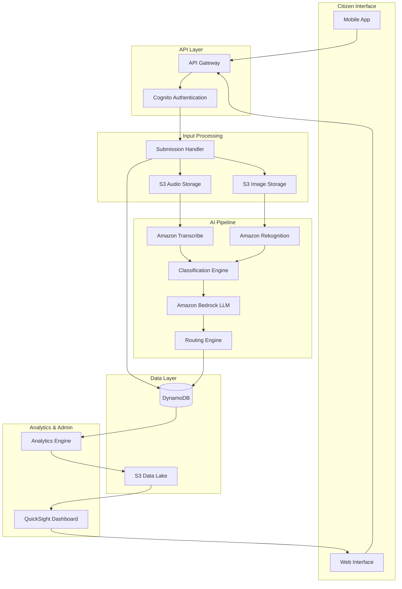

# Design Document: AEGIS Civic Platform

## Overview

The AEGIS platform is a cloud-native, AI-powered civic complaint management system built on AWS infrastructure. The architecture follows a serverless, event-driven design pattern to ensure scalability, cost-efficiency, and high availability. The system processes multimodal inputs (voice, text, images) through a modular AI pipeline that performs transcription, image analysis, classification, and intelligent routing.

The platform consists of three primary layers:
1. **Input Layer**: Handles citizen-facing interfaces and multimodal data ingestion
2. **Processing Layer**: AI pipeline for transcription, analysis, classification, and routing
3. **Storage & Analytics Layer**: Persistent storage and intelligence generation

Key design principles:
- Serverless-first architecture for automatic scaling
- Event-driven processing for loose coupling
- Modular AI components for flexibility
- API-first design for extensibility
- Security and privacy by design

## Architecture

### High-Level Architecture



### Component Interaction Flow

1. **Complaint Submission Flow**:
   - Citizen submits complaint via mobile/web → API Gateway
   - API Gateway authenticates request → Cognito
   - Submission Handler Lambda stores raw data → S3 + DynamoDB
   - S3 events trigger AI pipeline processing

2. **AI Processing Flow**:
   - Audio files → Amazon Transcribe → Text transcription
   - Images → Amazon Rekognition → Object/scene detection
   - Combined inputs → Classification Engine → Amazon Bedrock
   - Bedrock generates classification + summary + priority
   - Routing Engine assigns to department → Updates DynamoDB

3. **Status Tracking Flow**:
   - Citizen queries status → API Gateway → DynamoDB lookup
   - Status changes trigger notifications → SNS → Citizen

4. **Analytics Flow**:
   - Periodic Lambda aggregates complaint data → S3 Data Lake
   - QuickSight queries S3 for dashboard visualization
   - Risk hotspot detection runs on aggregated data

## Components and Interfaces

### 1. API Gateway

**Responsibility**: Expose RESTful API endpoints for all platform operations

**Endpoints**:
- `POST /complaints` - Submit new complaint
- `GET /complaints/{id}` - Retrieve complaint status
- `PUT /complaints/{id}/status` - Update complaint status (admin only)
- `GET /complaints` - List complaints with filters (admin only)
- `GET /analytics/hotspots` - Retrieve risk hotspots (admin only)
- `GET /analytics/dashboard` - Retrieve dashboard metrics (admin only)

**Interface Contract**:
```typescript
// Complaint Submission Request
interface ComplaintSubmissionRequest {
  citizenId: string;
  language: string;
  audioUrl?: string;  // S3 presigned URL
  textDescription?: string;
  imageUrls?: string[];  // S3 presigned URLs
  location: {
    latitude: number;
    longitude: number;
    address?: string;
  };
  timestamp: string;
}

// Complaint Submission Response
interface ComplaintSubmissionResponse {
  complaintId: string;
  trackingNumber: string;
  status: string;
  estimatedResolutionDays: number;
}

// Complaint Status Response
interface ComplaintStatusResponse {
  complaintId: string;
  trackingNumber: string;
  status: 'SUBMITTED' | 'PROCESSING' | 'ASSIGNED' | 'IN_PROGRESS' | 'RESOLVED' | 'CLOSED';
  classification: string;
  assignedDepartment: string;
  priority: number;
  submittedAt: string;
  updatedAt: string;
  estimatedResolutionDate: string;
  statusHistory: StatusHistoryEntry[];
}

interface StatusHistoryEntry {
  status: string;
  timestamp: string;
  actor: string;
  notes?: string;
}
```

### 2. Submission Handler Lambda

**Responsibility**: Process incoming complaint submissions and orchestrate initial storage

**Input**: ComplaintSubmissionRequest from API Gateway
**Output**: ComplaintSubmissionResponse

**Processing Steps**:
1. Validate request payload
2. Generate unique complaint ID and tracking number
3. Store audio/images to S3 with appropriate prefixes
4. Create initial complaint record in DynamoDB
5. Trigger AI pipeline via S3 event or direct invocation
6. Return tracking information to citizen

**Error Handling**:
- Invalid payload → 400 Bad Request
- S3 upload failure → Retry with exponential backoff
- DynamoDB write failure → Rollback S3 uploads, return 500

### 3. Transcription Service Integration

**Responsibility**: Convert audio to text in multiple languages

**Service**: Amazon Transcribe
**Supported Languages**: Hindi, English, Tamil, Telugu, Bengali, Marathi, Gujarati, Kannada, Malayalam, Punjabi (minimum 10)

**Processing**:
- Input: S3 audio file path
- Output: Transcribed text with confidence scores
- Configuration: Language code, audio format, vocabulary filtering

**Interface**:
```typescript
interface TranscriptionResult {
  complaintId: string;
  transcribedText: string;
  language: string;
  confidence: number;
  alternativeTranscriptions?: string[];
}
```

### 4. Image Analysis Service Integration

**Responsibility**: Extract visual information from uploaded images

**Service**: Amazon Rekognition
**Capabilities**: Object detection, scene detection, text extraction (OCR), unsafe content detection

**Processing**:
- Input: S3 image file paths
- Output: Detected objects, scene labels, extracted text, safety flags

**Interface**:
```typescript
interface ImageAnalysisResult {
  complaintId: string;
  imageUrl: string;
  detectedObjects: Array<{
    name: string;
    confidence: number;
    boundingBox?: BoundingBox;
  }>;
  sceneLabels: Array<{
    name: string;
    confidence: number;
  }>;
  extractedText: string;
  safetyFlags: {
    isSafe: boolean;
    categories: string[];
  };
}
```

### 5. Classification Engine Lambda

**Responsibility**: Classify complaints and generate structured summaries using LLM

**Service Integration**: Amazon Bedrock (Claude or Titan models)

**Input**:
- Transcribed text
- Image analysis results
- Original text description
- Location data

**Output**:
```typescript
interface ClassificationResult {
  complaintId: string;
  category: string;  // e.g., "ROAD_DAMAGE", "WATER_SUPPLY", "SANITATION"
  subcategory: string;
  confidence: number;
  summary: string;  // LLM-generated concise summary
  extractedEntities: {
    locations: string[];
    severityIndicators: string[];
    affectedInfrastructure: string[];
  };
  suggestedPriority: number;  // 1-10
}
```

**LLM Prompt Template**:
```
You are a civic complaint classification system. Analyze the following complaint information and provide structured output.

Transcribed Text: {transcribedText}
Image Analysis: {imageAnalysis}
Location: {location}

Classify this complaint into one of these categories: [ROAD_DAMAGE, WATER_SUPPLY, SANITATION, ELECTRICITY, STREET_LIGHTING, WASTE_MANAGEMENT, DRAINAGE, PUBLIC_SAFETY, PARKS_RECREATION, BUILDING_VIOLATION, NOISE_POLLUTION, AIR_POLLUTION, WATER_POLLUTION, TRAFFIC_SIGNAL, POTHOLE, ILLEGAL_DUMPING, STRAY_ANIMALS, TREE_MAINTENANCE, SIDEWALK_REPAIR, OTHER]

Provide:
1. Primary category
2. Subcategory (if applicable)
3. Confidence score (0-1)
4. Brief summary (max 100 words)
5. Severity indicators found
6. Suggested priority (1-10, where 10 is most urgent)

Format your response as JSON.
```

### 6. Routing Engine Lambda

**Responsibility**: Assign complaints to appropriate departments based on classification

**Input**: ClassificationResult
**Output**: Routing decision with assigned department

**Department Mapping**:
```typescript
interface DepartmentMapping {
  category: string;
  primaryDepartment: string;
  secondaryDepartments?: string[];
  escalationThreshold: number;  // Priority level for escalation
}

// Example mappings
const DEPARTMENT_MAPPINGS: DepartmentMapping[] = [
  {
    category: 'ROAD_DAMAGE',
    primaryDepartment: 'PUBLIC_WORKS',
    secondaryDepartments: ['TRAFFIC_MANAGEMENT'],
    escalationThreshold: 8
  },
  {
    category: 'WATER_SUPPLY',
    primaryDepartment: 'WATER_DEPARTMENT',
    escalationThreshold: 7
  },
  // ... more mappings
];
```

**Routing Logic**:
1. Look up primary department from category
2. Check if priority exceeds escalation threshold
3. If escalated, notify secondary departments
4. Update complaint record with routing information
5. Send notification to assigned department

### 7. Priority Scoring Algorithm

**Responsibility**: Calculate complaint priority based on multiple factors

**Factors**:
- Severity indicators from text/images (weight: 40%)
- Safety hazards detected (weight: 30%)
- Affected population estimate (weight: 20%)
- Historical complaint density in area (weight: 10%)

**Algorithm**:
```typescript
function calculatePriority(
  severityScore: number,  // 0-10 from LLM
  hasSafetyHazard: boolean,
  affectedPopulation: number,
  historicalDensity: number
): number {
  let priority = severityScore * 0.4;
  
  if (hasSafetyHazard) {
    priority += 3.0;  // 30% boost
  }
  
  // Population impact: 0-2 points
  const populationScore = Math.min(affectedPopulation / 500, 2.0);
  priority += populationScore;
  
  // Historical density: 0-1 points
  const densityScore = Math.min(historicalDensity / 10, 1.0);
  priority += densityScore;
  
  return Math.min(Math.round(priority), 10);
}
```

### 8. Risk Hotspot Detection

**Responsibility**: Identify geographic areas with recurring issues

**Processing**:
- Runs as scheduled Lambda (daily)
- Queries DynamoDB for complaints in last 30 days
- Groups by location (1km radius clustering)
- Identifies clusters with 5+ complaints of same category
- Stores hotspots in DynamoDB
- Triggers notifications to relevant departments

**Algorithm**:
```typescript
interface RiskHotspot {
  hotspotId: string;
  centerLocation: {
    latitude: number;
    longitude: number;
  };
  radius: number;  // meters
  category: string;
  complaintCount: number;
  firstDetected: string;
  lastUpdated: string;
  affectedArea: string;
  trend: 'INCREASING' | 'STABLE' | 'DECREASING';
}

function detectHotspots(complaints: Complaint[]): RiskHotspot[] {
  // 1. Group complaints by category
  // 2. For each category, cluster by location (DBSCAN or k-means)
  // 3. Filter clusters with count >= 5
  // 4. Calculate trend by comparing with previous period
  // 5. Return hotspot objects
}
```

## Data Models

### DynamoDB Schema

**Table: Complaints**
- Partition Key: `complaintId` (String)
- Sort Key: `timestamp` (Number)
- GSI1: `citizenId-timestamp-index` for citizen's complaint history
- GSI2: `department-status-index` for department queues
- GSI3: `location-category-index` for hotspot detection

```typescript
interface ComplaintRecord {
  complaintId: string;  // PK
  timestamp: number;  // SK (Unix timestamp)
  trackingNumber: string;
  citizenId: string;
  
  // Input data
  language: string;
  audioS3Key?: string;
  imageS3Keys?: string[];
  textDescription?: string;
  location: {
    latitude: number;
    longitude: number;
    address?: string;
    geohash: string;  // For spatial queries
  };
  
  // AI processing results
  transcription?: TranscriptionResult;
  imageAnalysis?: ImageAnalysisResult[];
  classification?: ClassificationResult;
  
  // Routing and status
  assignedDepartment: string;
  status: string;
  priority: number;
  
  // Timestamps
  submittedAt: string;
  processedAt?: string;
  assignedAt?: string;
  resolvedAt?: string;
  
  // Audit trail
  statusHistory: StatusHistoryEntry[];
  
  // Metadata
  estimatedResolutionDate: string;
  actualResolutionDate?: string;
  citizenFeedback?: {
    rating: number;
    comments: string;
  };
}
```

**Table: RiskHotspots**
- Partition Key: `hotspotId` (String)
- Sort Key: `detectedDate` (String)
- GSI1: `category-complaintCount-index` for prioritization

```typescript
interface RiskHotspotRecord {
  hotspotId: string;  // PK
  detectedDate: string;  // SK
  centerLocation: {
    latitude: number;
    longitude: number;
    geohash: string;
  };
  radius: number;
  category: string;
  complaintIds: string[];
  complaintCount: number;
  trend: string;
  affectedArea: string;
  notifiedDepartments: string[];
  status: 'ACTIVE' | 'MONITORING' | 'RESOLVED';
}
```

**Table: DepartmentMappings**
- Partition Key: `category` (String)

```typescript
interface DepartmentMappingRecord {
  category: string;  // PK
  primaryDepartment: string;
  secondaryDepartments: string[];
  escalationThreshold: number;
  averageResolutionDays: number;
  contactEmail: string;
}
```

### S3 Bucket Structure

```
aegis-complaints-{env}/
├── audio/
│   └── {complaintId}/
│       └── original.{format}
├── images/
│   └── {complaintId}/
│       ├── image1.jpg
│       └── image2.jpg
├── processed/
│   └── {complaintId}/
│       ├── transcription.json
│       └── image-analysis.json
└── data-lake/
    ├── complaints/
    │   └── year={yyyy}/month={mm}/day={dd}/
    └── analytics/
        └── hotspots/
```


## Correctness Properties

*A property is a characteristic or behavior that should hold true across all valid executions of a system—essentially, a formal statement about what the system should do. Properties serve as the bridge between human-readable specifications and machine-verifiable correctness guarantees.*

### Voice Processing Properties

**Property 1: Audio Capture Completeness**
*For any* valid audio input, the platform should successfully capture and store the audio data.
**Validates: Requirements 1.1**

**Property 2: Transcription Round-Trip**
*For any* captured audio file, transcribing it should produce text that can be stored and retrieved with the complaint record.
**Validates: Requirements 1.2, 1.3**

**Property 3: Transcription Error Handling**
*For any* audio input with insufficient quality, the platform should return an error response requesting re-recording rather than producing invalid transcription.
**Validates: Requirements 1.4**

### Multilingual Processing Properties

**Property 4: Language Processing Consistency**
*For any* supported language selection, all voice and text processing should use that language consistently throughout the complaint lifecycle.
**Validates: Requirements 2.2**

**Property 5: Language Preservation**
*For any* complaint with translation, the original language version should remain accessible and unchanged after translation operations.
**Validates: Requirements 2.5**

**Property 6: Status Display Localization**
*For any* complaint and selected language, the status information should be presented in that language.
**Validates: Requirements 2.3**

**Property 7: Automatic Language Detection**
*For any* voice input in a supported language without explicit language selection, the system should correctly identify the language.
**Validates: Requirements 2.4**

### Image Processing Properties

**Property 8: Image Format Acceptance**
*For any* image in JPEG, PNG, or HEIC format, the platform should accept and process the upload.
**Validates: Requirements 3.1**

**Property 9: Image Analysis Execution**
*For any* uploaded image, the platform should perform analysis and return results.
**Validates: Requirements 3.3**

**Property 10: Image Analysis Metadata Completeness**
*For any* analyzed image, the results should contain detected objects, scene labels, and extracted text fields.
**Validates: Requirements 3.4**

**Property 11: Graceful Image Upload Degradation**
*For any* complaint submission where image upload fails, the complaint should still be submittable with other data intact.
**Validates: Requirements 3.6**

### Classification Properties

**Property 12: Classification Category Validity**
*For any* submitted complaint, the classification should produce a category from the predefined set of valid categories.
**Validates: Requirements 4.1**

**Property 13: Classification Summary Generation**
*For any* classified complaint, a structured summary should be generated.
**Validates: Requirements 4.3**

**Property 14: Entity Extraction Completeness**
*For any* classified complaint, the extracted entities should include location, issue type, and severity indicators fields.
**Validates: Requirements 4.4**

**Property 15: Multimodal Classification Unification**
*For any* complaint with multiple input types (voice, text, images), the classification should produce a single unified result that considers all inputs.
**Validates: Requirements 4.5**

**Property 16: Classification Confidence Presence**
*For any* classification result, a confidence score should be present in the output.
**Validates: Requirements 4.6**

### Routing Properties

**Property 17: Department Assignment Completeness**
*For any* classified complaint, a responsible department should be determined and assigned.
**Validates: Requirements 5.1**

**Property 18: Department Queue Routing**
*For any* complaint with an assigned department, the complaint should appear in that department's queue.
**Validates: Requirements 5.3**

**Property 19: Multi-Authority Routing**
*For any* complaint with multiple responsible authorities, the complaint should be routed to the primary authority and secondary authorities should be notified.
**Validates: Requirements 5.4**

**Property 20: Routing Notification**
*For any* routed complaint, a notification containing the assigned department should be sent to the citizen.
**Validates: Requirements 5.5**

### Priority Scoring Properties

**Property 21: Priority Score Range Validity**
*For any* classified complaint, the calculated priority score should be between 1 and 10 inclusive.
**Validates: Requirements 6.1**

**Property 22: Safety Hazard Priority Increase**
*For any* complaint, adding safety hazard indicators should result in a higher priority score than the same complaint without safety hazards.
**Validates: Requirements 6.3**

**Property 23: Location Density Priority Increase**
*For any* location with multiple complaints, later complaints at that location should have higher priority than if they were isolated complaints.
**Validates: Requirements 6.4**

**Property 24: Manual Priority Adjustment Persistence**
*For any* complaint where an admin adjusts the priority, the new priority and justification should be stored and retrievable.
**Validates: Requirements 6.5**

### Dashboard Properties

**Property 25: Complaint Display Completeness**
*For any* complaint in the system, it should appear in the admin dashboard with its current status.
**Validates: Requirements 7.1**

**Property 26: Filter Result Accuracy**
*For any* filter criteria (department, priority, status, date range), the dashboard results should only include complaints matching all specified criteria.
**Validates: Requirements 7.2**

**Property 27: Complaint Detail Completeness**
*For any* complaint displayed in the dashboard, the detail view should include transcription, classification, images, and routing information fields.
**Validates: Requirements 7.3**

**Property 28: Department Reassignment**
*For any* complaint, an admin should be able to change the assigned department and the change should be reflected in the complaint record.
**Validates: Requirements 7.4**

**Property 29: Audit Trail Completeness**
*For any* complaint, the audit trail should include all status changes and administrative actions performed on that complaint.
**Validates: Requirements 7.6**

### Status Tracking Properties

**Property 30: Tracking ID Uniqueness**
*For any* two different complaint submissions, the generated tracking identifiers should be unique.
**Validates: Requirements 8.1**

**Property 31: Tracking ID Immediate Availability**
*For any* complaint submission, the response should include the tracking identifier.
**Validates: Requirements 8.2**

**Property 32: Status Query Response**
*For any* valid complaint tracking ID query, the current status should be returned.
**Validates: Requirements 8.3**

**Property 33: Status Change Notification**
*For any* complaint status change, a notification should be sent to the citizen.
**Validates: Requirements 8.4**

**Property 34: Resolution Time Estimation**
*For any* complaint, an estimated resolution time should be calculated and included in the response.
**Validates: Requirements 8.5**

**Property 35: Resolution Feedback Request**
*For any* complaint marked as resolved, a feedback request should be sent to the citizen.
**Validates: Requirements 8.6**

### Risk Hotspot Properties

**Property 36: Hotspot Detection Threshold**
*For any* geographic area with 5 or more complaints of the same category within 1km radius in 30 days, the area should be flagged as a risk hotspot.
**Validates: Requirements 9.2**

**Property 37: Hotspot Map Display**
*For any* detected risk hotspot, it should appear on the geographic map in the admin dashboard.
**Validates: Requirements 9.3**

**Property 38: Hotspot Detection Notification**
*For any* newly detected risk hotspot, notifications should be sent to the relevant public authorities.
**Validates: Requirements 9.4**

**Property 39: Hotspot Trend Persistence**
*For any* risk hotspot, trend data should be maintained and retrievable over time.
**Validates: Requirements 9.5**

### Bandwidth Optimization Properties

**Property 40: Audio Compression**
*For any* audio file upload, the uploaded file size should be smaller than the original file size.
**Validates: Requirements 10.1**

**Property 41: Image Compression with Quality**
*For any* image upload, the uploaded file size should be smaller than the original while still being analyzable by the image analysis service.
**Validates: Requirements 10.2**

**Property 42: Network Failure Retry Queuing**
*For any* submission that fails due to network connectivity issues, the submission should be queued for automatic retry.
**Validates: Requirements 10.3**

**Property 43: Progressive Upload Resumption**
*For any* interrupted upload, the partial data should be saved and the upload should be resumable from the interruption point.
**Validates: Requirements 10.5**

### Security Properties

**Property 44: Transit Encryption**
*For any* data transmission between client and server, TLS 1.3 or higher should be used.
**Validates: Requirements 11.1**

**Property 45: Storage Encryption**
*For any* data stored in the system, it should be encrypted at rest.
**Validates: Requirements 11.2**

**Property 46: Role-Based Access Control**
*For any* user action, access should be granted only if the user's role has permission for that action.
**Validates: Requirements 11.3**

**Property 47: Analytics Anonymization**
*For any* public analytics output, citizen personal information should not be present in the results.
**Validates: Requirements 11.4**

**Property 48: Data Deletion with Statistics Retention**
*For any* citizen data deletion request, personal information should be removed while anonymized complaint statistics remain accessible.
**Validates: Requirements 11.5**

**Property 49: Audit Logging**
*For any* access to complaint data, an audit log entry should be created with timestamp, user, and action details.
**Validates: Requirements 11.6**

### AI Pipeline Properties

**Property 50: Model A/B Testing Support**
*For any* AI classification request, the system should be able to route to different model configurations for A/B testing.
**Validates: Requirements 13.4**

**Property 51: AI Performance Metrics Logging**
*For any* AI service invocation, performance metrics (latency, token count, model version) should be logged.
**Validates: Requirements 13.5**

## Error Handling

### Error Categories

1. **Input Validation Errors**
   - Invalid audio format or duration
   - Invalid image format or size
   - Missing required fields
   - Invalid location coordinates

2. **Service Integration Errors**
   - Transcription service unavailable
   - Image analysis service unavailable
   - LLM service unavailable
   - Database write failures

3. **Business Logic Errors**
   - Unable to classify complaint
   - No department mapping found
   - Invalid priority calculation

4. **Network Errors**
   - Upload timeout
   - Connection failures
   - Bandwidth limitations

### Error Handling Strategies

**Retry with Exponential Backoff**:
- Applied to: Service integration failures, network errors
- Configuration: 3 retries, backoff multiplier 2x, max delay 30s

**Circuit Breaker Pattern**:
- Applied to: External service calls (Transcribe, Rekognition, Bedrock)
- Configuration: Open after 5 consecutive failures, half-open after 60s

**Graceful Degradation**:
- Image upload failure → Allow submission without images
- Classification confidence < 0.5 → Route to manual review queue
- Language detection failure → Default to English with notification

**Dead Letter Queue**:
- Failed complaint processing → DLQ for manual intervention
- Failed notifications → DLQ with retry after 1 hour

**Error Response Format**:
```typescript
interface ErrorResponse {
  error: {
    code: string;  // e.g., "TRANSCRIPTION_FAILED"
    message: string;  // Human-readable message
    details?: any;  // Additional context
    retryable: boolean;
    retryAfter?: number;  // Seconds
  };
  requestId: string;
  timestamp: string;
}
```

### Monitoring and Alerting

**Key Metrics**:
- Complaint submission success rate (target: > 99%)
- Average processing time (target: < 30s)
- Classification accuracy (target: > 90%)
- Service availability (target: > 99.9%)

**Alert Conditions**:
- Error rate > 5% for 5 minutes
- Processing time > 60s for 10 consecutive requests
- Service unavailable for > 1 minute
- DLQ depth > 100 messages

## Testing Strategy

### Dual Testing Approach

The AEGIS platform requires both unit testing and property-based testing for comprehensive coverage:

**Unit Tests**: Focus on specific examples, edge cases, and error conditions
- Specific complaint scenarios (e.g., road damage with image)
- Edge cases (5-minute audio, 10MB images, 5 images per complaint)
- Error conditions (invalid formats, service failures)
- Integration points between components

**Property-Based Tests**: Verify universal properties across all inputs
- Universal properties that hold for all valid inputs
- Comprehensive input coverage through randomization
- Minimum 100 iterations per property test
- Each test references its design document property

Together, these approaches provide comprehensive coverage where unit tests catch concrete bugs and property tests verify general correctness.

### Property-Based Testing Configuration

**Framework Selection**:
- Python: Hypothesis
- TypeScript/JavaScript: fast-check
- Java: jqwik

**Test Configuration**:
- Minimum 100 iterations per property test
- Each test tagged with: **Feature: aegis-civic-platform, Property {number}: {property_text}**
- Each correctness property implemented by a SINGLE property-based test

**Example Property Test Structure** (Python with Hypothesis):
```python
from hypothesis import given, strategies as st
import pytest

@given(
    audio_file=st.binary(min_size=1000, max_size=5*60*48000),  # Up to 5 min
    language=st.sampled_from(['en', 'hi', 'ta', 'te', 'bn'])
)
def test_property_2_transcription_round_trip(audio_file, language):
    """
    Feature: aegis-civic-platform, Property 2: Transcription Round-Trip
    For any captured audio file, transcribing it should produce text 
    that can be stored and retrieved with the complaint record.
    """
    # Submit complaint with audio
    complaint_id = submit_complaint(audio=audio_file, language=language)
    
    # Retrieve complaint
    complaint = get_complaint(complaint_id)
    
    # Verify transcription exists and is stored
    assert complaint.transcription is not None
    assert len(complaint.transcription.text) > 0
    assert complaint.transcription.language == language
```

### Unit Testing Strategy

**Test Organization**:
- Component-level tests for each Lambda function
- Integration tests for API Gateway endpoints
- Service integration tests with mocked AWS services

**Coverage Targets**:
- Code coverage: > 80%
- Branch coverage: > 75%
- Critical path coverage: 100%

**Key Unit Test Areas**:
1. Input validation and sanitization
2. Priority scoring algorithm with known inputs
3. Department routing logic with edge cases
4. Hotspot detection with specific geographic patterns
5. Error handling and retry logic

### Integration Testing

**Test Scenarios**:
1. End-to-end complaint submission flow
2. Multi-language complaint processing
3. Image analysis integration
4. Department routing and notification
5. Admin dashboard operations
6. Status tracking and updates

**Test Environment**:
- LocalStack for AWS service mocking
- Test DynamoDB tables
- Test S3 buckets
- Mock Bedrock responses for consistent testing

### Performance Testing

**Load Testing**:
- Simulate 1000 concurrent complaint submissions
- Measure response times under load
- Verify auto-scaling behavior

**Stress Testing**:
- Test with 10x normal load
- Identify breaking points
- Verify graceful degradation

**Tools**: Apache JMeter, AWS Load Testing Solution

### Security Testing

**Test Areas**:
- Authentication and authorization
- Input sanitization and injection prevention
- Encryption verification (transit and rest)
- RBAC enforcement
- Data anonymization in analytics

**Tools**: OWASP ZAP, AWS Security Hub
